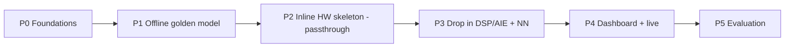

# Master Thesis Plan — WiFi‑CSI Human Activity Recognition on the VCK190 AI Engine

> **One‑line thesis:** *Stream WiFi Channel‑State‑Information (CSI) from a Raspberry Pi (nexmon) over Ethernet into a Versal VCK190, parse UDP and run the full CSI DSP + neural‑network activity‑recognition pipeline on the **Programmable Logic (PL) + AI Engine (AIE)** array, and DMA only the compact results to Linux on the Arm processor for visualization — quantifying the latency / throughput / power advantage of AIE offload versus a CPU‑only baseline.*

Status: **DRAFT PROPOSAL for discussion.** Nothing here is final — the "Cool things we can build" menu (Section 12) and the "Open questions / decisions" (Section 17) are meant to be reviewed together before we lock scope.

---

## 1. Executive summary

- A **Raspberry Pi** running the **nexmon_csi** firmware patch turns its WiFi chip into a CSI sensor. Human motion (walking, sitting, falling, breathing) perturbs the WiFi channel; CSI captures those perturbations.
- The Pi packetizes CSI and sends it as **UDP over its Ethernet port** to the **VCK190**.
- On the VCK190 we **parse the UDP/CSI stream in the FPGA**, run the heavy math — FFTs, filtering, feature extraction, and the neural‑network inference — on the **AI Engine array + PL**, and **DMA only the final results** (activity label, vitals, keypoints, presence/occupancy) into DDR for a **Linux** app (PetaLinux or Yocto) to visualize.
- The **research contribution** is the hardware/software co‑design and the measured benefit of moving the CSI pipeline off the CPU onto AIE/PL on a real edge ACAP.

The two reference software stacks in the repo drive the design:
- **[nexmon](Versal-Ethernet/VCK190-Ethernet/2022.1/ps_emio_basex_1g/Software/nexmon/README.md)** — the CSI capture side (Raspberry Pi firmware patching framework).
- **[ruview](Versal-Ethernet/VCK190-Ethernet/2022.1/ps_emio_basex_1g/Software/ruview/README.md)** — a rich WiFi‑sensing platform ("WiFi DensePose / RuView") that documents an entire CSI → DSP → ML pipeline and dozens of sensing capabilities. It is our **algorithm reference** (what to compute) and our **idea bank** (Section 12).

---

### ✅ Decisions locked (v1 — from first review)

These choices are fixed for v1; the rest of this document is written to them.

| Topic | Decision |
|---|---|
| **Core deliverables** | **HAR + Fall + Breathing** (guaranteed) **and a live WiFi pose / DensePose skeleton** (qualitative demo, not a PCK benchmark) |
| **CSI hardware** | **Raspberry Pi 4 (bcm43455c0)** primary + **Pi 3B+/Zero‑class** secondary → **multi‑Pi capture in scope** |
| **Physical link** | **Pi packets arrive at the VCK190 over SFP** — user supplies the SFP modules / media conversion; assume frames reach the GT as a given |
| **CSI source** | **nexmon_csi already working** (done previously, handled separately) → treat the Pi as a ready UDP CSI source |
| **Sequencing** | **Offline → inline HW skeleton (passthrough) → drop in AIE/DPU → live.** The separate PS‑terminated **Arch A is dropped**; go straight to inline **Arch B** (kept as fallback only) |
| **Tools / OS** | **Upgrade to Vivado/Vitis 2023.2 or 2024.2** + **PetaLinux** |
| **Models / training** | **Pretrained only, no training** (ruview pretrained weights); an existing **Hugging Face CSI dataset** is used for offline validation — no new data collection planned |
| **NN deployment** | Do **both** hand‑written **AIE kernels** *and* **Vitis‑AI DPU**, and **compare** (a thesis contribution) |
| **Visualization** | **Dashboard** (WebSocket/MQTT), not a minimal viewer |

All eight review questions are now answered — see the phased task list in Section 13.

---

## 2. Background: why this works

WiFi CSI is the per‑subcarrier complex channel response $H[k] = |H[k]|\,e^{\,j\angle H[k]}$ measured by the OFDM receiver. When a person moves in the environment, multipath reflections change, modulating amplitude and phase over time. From a time series of CSI frames we can extract:

- **Coarse motion** (variance / motion‑band power) → presence, activity.
- **Micro‑motion** (0.1–0.5 Hz phase modulation) → breathing; (0.8–2.0 Hz) → heart rate.
- **Velocity** (Doppler shift $v = f_d\,\lambda/2$) → gestures, gait, activity.
- **Spatial structure** (multipath / CIR taps) → through‑wall geometry, pose.

These operations are **FFT‑heavy, filter‑heavy, and MAC‑heavy** — exactly what the Versal **AI Engine** (vectorized complex FFT + GEMM/conv) and **PL** (streaming protocol parsing, CORDIC, median filters) are good at. That is the core reason this maps beautifully to VCK190.

---

## 3. System overview

```mermaid
flowchart LR
    subgraph RPi["Raspberry Pi (bcm43455c0)"]
      W[WiFi RX + nexmon_csi] --> UDP[UDP CSI packetizer]
      UDP --> ETH[Ethernet eth0]
    end

    ETH -->|1000BASE-T cable| SFP[Copper SFP / media converter]

    subgraph VCK190["AMD Versal VCK190 ACAP"]
      SFP --> GT[GTY transceiver + PCS/PMA]
      GT --> MAC[Ethernet MAC]
      MAC --> PARSE[PL: UDP/CSI parser + I/Q depacketize]
      PARSE --> DSP[AIE+PL: phase clean, FFT/CIR, STFT, BVP, bandpass]
      DSP --> NN[AIE: NN inference - activity / vitals / pose]
      NN --> DMA[PL DMA -> NoC -> DDR4]
      DMA --> PS[Arm Cortex-A72 - Linux]
      PS --> VIS[Dashboard / API / MQTT]
    end

    VIS --> USER[User / Home Assistant / Web UI]
```



Only the **compact results** cross the DMA boundary into Linux — raw CSI (hundreds of KB/s to MB/s) never has to touch the CPU in the target architecture.

---

## 4. What the current design actually is (baseline analysis)

Design under study: **[ps_emio_basex_1g](Versal-Ethernet/VCK190-Ethernet/2022.1/ps_emio_basex_1g/README.md)** (Vivado **2022.1**, part `xcvc1902-vsva2197-2MP-e-S`, board `xilinx.com:vck190:2.2`).

From [ps_emio_basex_bd.tcl](Versal-Ethernet/VCK190-Ethernet/2022.1/ps_emio_basex_1g/Scripts/ps_emio_basex_bd.tcl):

| Block | Role | Note for us |
|------|------|-------------|
| `versal_cips_0` | Arm PS + PMC; **GEM0 is the Ethernet MAC** | `EMAC_IF_TEMAC {GEM}`, `PS_ENET0 {IO EMIO}` |
| `gig_ethernet_pcs_pma_0` (16.2) | 1G **PCS/PMA** (1000BASE‑X) | Fed by PS GEM0 over **GMII via EMIO** |
| `gt_quad_base` / `gt_ibufds_gte5` | GTY transceiver to SFP0 | Physical serial link |
| `axi_noc_0` (1.0) | NoC to **DDR4 DIMM** (`CH0_DDR4_0`) | We already have external DDR — good |
| `axi_gpio_*`, `smartconnect_0` | Control/status | — |
| `clk_wizard_0`, `proc_sys_reset_0` | Clocks/resets | — |

**Critical architectural fact:** the RX path is `SFP0 → GT → PCS/PMA → GMII/EMIO → PS GEM0 → Linux`. The **PL never sees the packet payload as an AXI‑Stream**, and there is **no AI Engine and no DMA engine instantiated**. So:

- ✅ Ethernet bring‑up, GT/PCS/PMA, DDR4 + NoC already exist and are reusable.
- ❌ To process packets in the FPGA we must get the RX packets into the PL as a **stream**, add the **AI Engine**, and add a **DMA path** back to DDR.

This gap is precisely the engineering content of the thesis.

---

## 5. Two target architectures (and the recommended path)

### Architecture A — *PS‑terminated, AIE‑offload* (lower risk, first milestone)
Keep PS GEM0 as the MAC. Linux receives UDP CSI on a socket, writes raw CSI into DDR, and hands it to an **AIE graph + PL kernels** via an **AXI DMA (MM2S/S2MM)**; results come back to DDR and up to the app.

- **Pros:** reuses the existing Ethernet path verbatim; fastest route to a working AIE pipeline; easy to validate numerically against the Python/ruview reference.
- **Cons:** the CPU still touches every packet (memcpy from socket to DDR), so it is *not yet* "maximum processing in the FPGA."

### Architecture B — *PL‑terminated, inline* (the thesis target)
Add a **PL Ethernet MAC** (AXI 1G/2.5G Ethernet Subsystem) driven by the **existing PCS/PMA + GT**, so RX packets enter the PL as **AXI‑Stream**. A **custom UDP/CSI parser** (HLS/RTL) filters the CSI UDP port, strips headers, extracts I/Q, and streams straight into the AIE. **Only results** are DMA'd to DDR for Linux.

- **Pros:** true "max processing in FPGA," CPU load minimal, best latency/power story — the compelling thesis result.
- **Cons:** more RTL/HLS work; must re‑home the Ethernet MAC into PL. Optionally keep **PS GEM0 on a second SFP** for the control/UI network so Linux still has normal networking.

```mermaid
flowchart TB
    subgraph A["Arch A - de-risk first"]
      A1[PS GEM0 MAC] --> A2[Linux UDP socket]
      A2 --> A3[DDR raw CSI]
      A3 --> A4[AXI DMA MM2S]
      A4 --> A5[AIE + PL pipeline]
      A5 --> A6[S2MM -> DDR results]
      A6 --> A7[Viz app]
    end
    subgraph B["Arch B - thesis target"]
      B1[PL AXI-Ethernet MAC] --> B2[PL UDP/CSI parser]
      B2 --> B3[AIE + PL pipeline]
      B3 --> B4[S2MM -> DDR results only]
      B4 --> B5[Viz app]
    end
```



**Recommendation (v1, updated):** go **straight to Arch B** using a *walking‑skeleton* order — build the inline `Pi → PL parser → DMA → Linux` path with a **passthrough** first (prove raw CSI reaches Linux bit‑exact), then drop in the AIE/PL compute. We **skip the separate Arch A build**; numerical confidence instead comes from **`aiesimulator`** kernel checks, and the CPU‑only baseline is measured **in software on the A72**. Arch A remains documented above only as the fallback if inline MAC bring‑up stalls. See Section 13.

---

## 6. Compute partitioning — PS vs PL vs AI Engine

This table is the heart of the co‑design. Reference pipeline stages are from ruview's signal crate (`wifi-densepose-signal`, ADR‑136/014/021).

| Pipeline stage | Operation | Best target | Why |
|---|---|---|---|
| Ethernet MAC | 1G MAC, RX AXI‑Stream | **PL** (Arch B) / PS GEM (Arch A) | line‑rate framing |
| UDP/CSI parse | port filter, header strip, I/Q depacketize, seq‑number tracking | **PL** (HLS/RTL) | cheap streaming protocol offload |
| I/Q → amplitude/phase | $\lvert H\rvert=\sqrt{I^2+Q^2}$, $\angle H=\operatorname{atan2}(Q,I)$ | **PL CORDIC** or AIE | CORDIC is ideal in PL |
| Phase sanitization | conjugate multiply $H_i\,\overline{H_j}$, linear‑phase removal (SpotFi) | **AIE** | vector complex multiply |
| Outlier removal | Hampel / median ± $1.4826\,\mathrm{MAD}$ | **PL** (sorting network) | streaming median |
| CIR / multipath | IFFT (64/128/256‑pt) | **AIE** | AIE complex FFT |
| Spectrogram | STFT (Hann, ~1 s), $S[t,f]=\lvert\sum_n x[n]w[n-t]e^{-j2\pi fn}\rvert^2$ | **AIE** | FFT‑dense |
| BVP / Doppler | short‑time DFT + $v=f_d\lambda/2$ mapping (Widar 3.0) | **AIE** | FFT‑dense, domain‑invariant features |
| Bandpass vitals | 2nd‑order Butterworth IIR, 0.1–0.5 Hz & 0.8–2.0 Hz | **AIE** (or PS — tiny) | low‑rate, small |
| Subcarrier select | variance ranking, top‑K | **PL/PS** | light control logic |
| Windowing / buffering | ring buffers, tensor reshape | **PL + DDR** | data movement |
| NN inference | contrastive encoder, pose transformer, counting head (GEMM/conv) | **AIE** (or Vitis‑AI **DPU**) | MAC‑dense |
| Post‑processing | thresholds, debounce, state machine (fall, presence) | **PS** | control plane |
| Result DMA | S2MM → NoC → DDR | **PL DMA + NoC** | move only results |
| Visualization / API | dashboard, WebSocket/MQTT | **PS (Linux)** | UX + integration |

**Rule of thumb:** *streaming + bit‑manipulation → PL; FFT/GEMM/filters → AIE; control + UX → PS.*

---

## 7. The CSI wire format we must parse

> ⚠️ **Important nuance discovered during review:** the local **[nexmon](Versal-Ethernet/VCK190-Ethernet/2022.1/ps_emio_basex_1g/Software/nexmon)** copy is the *base* firmware‑patching framework; the CSI‑specific extension (`makecsiparams`, the CSI extractor, and the exact packet layout) lives in the separate **seemoo‑lab/nexmon_csi** project. The **ruview** repo documents an internal normalized frame (ADR‑018, magic `0xC5110001`). **These are two different formats.** The FPGA parser must target the **actual nexmon_csi wire format emitted by the Pi**, which we will confirm empirically with a capture. Plan for a *configurable* parser.

**Raspberry Pi chip:** Pi 3B+/4/5 use **bcm43455c0** (also Pi3/Zero W = bcm43430a1, Pi Zero 2 W = bcm43436b0), per [nexmon/README.md](Versal-Ethernet/VCK190-Ethernet/2022.1/ps_emio_basex_1g/Software/nexmon/README.md). Recommended: **Pi 4 + bcm43455c0**, firmware `7_45_206`.

**nexmon_csi framing (to validate):** UDP datagrams (commonly **port 5500**, broadcast/unicast to a configured IP) with a small header (magic, RSSI, frame‑control, source MAC, sequence number, core/spatial‑stream, chanspec, chip id) followed by CSI as **int16 I/Q pairs per subcarrier**.

**Subcarriers per bandwidth (bcm43455c0, 1×1):** all FFT bins are reported (including guard/pilot/DC):

| Bandwidth | Subcarriers | CSI bytes (int16 I/Q) | Rate (typical) |
|---|---|---|---|
| 20 MHz | 64 | 256 | 10–100 CSI frames/s |
| 40 MHz | 128 | 512 | (AP‑traffic dependent) |
| 80 MHz | 256 | 1024 | up to ~200 fps burst |

Parser responsibilities in PL: match UDP port, strip Eth/IP/UDP (42 B), read header, deinterleave I/Q, sign‑extend int16, tag with sequence number, and emit an AXI‑Stream tensor `[n_subcarriers]` complex per frame to the AIE. Sequence numbers feed **packet‑loss handling** (UDP is lossy).

**Pi‑side capture/trigger workflow** (validated on Pi before FPGA parsing):
```bash
# on the Raspberry Pi (bcm43455c0)
nexutil -m1                                   # monitor mode
CSI_PARAMS=$(makecsiparams -c 36/80 -C 1 -N 1)  # channel/bw/cores/streams
nexutil -k "$CSI_PARAMS"                        # arm CSI extraction
tcpdump -i wlan0 'udp port 5500' -w csi.pcap    # confirm the stream
```
We will parse `csi.pcap` with **CSIKit** as the golden reference to lock the exact byte layout before writing HLS.

---

## 8. AI Engine design plan

Build an **ADF graph** (Vitis `aiecompiler`) of reusable kernels; stream data in/out through **PLIO** (AXI‑Stream to/from PL):

- `phase_sanitize` — complex conjugate multiply + linear‑phase removal.
- `fft_cir` — 64/128/256‑pt complex FFT/IFFT (AIE FFT library).
- `stft_spectrogram` — windowed FFT → time‑frequency tiles.
- `bvp_doppler` — short‑time DFT + velocity mapping.
- `fir_bandpass` — biquad IIR bank for breathing/heart‑rate.
- `gemm_encoder` — 128‑dim contrastive CSI encoder (TCN/attention).
- `gemm_pose` / `gemm_count` — 17‑keypoint pose head / occupancy counter.

Data flow: `PL parser → PLIO → [phase_sanitize → fft/stft → features] → [NN kernels] → PLIO → PL DMA`. Weights/params for the NN are loaded from DDR at init (PS control).

**NN deployment — do BOTH and compare (locked decision):**
1. **Hand‑written AIE kernels** — maximum control, best for the "we mapped it ourselves" narrative; the main research artifact.
2. **Vitis‑AI DPU (DPUCVDX8G)** on Versal — quantize the CNN/pose model onto a pre‑built DPU while AIE/PL do the DSP; fast path to a working demo and the **baseline we benchmark the hand‑written kernels against**.

The **AIE‑kernel vs DPU** comparison (accuracy, latency, AIE‑tile/PL resource use) is an explicit thesis result (Section 14). Weights come from **ruview pretrained + MM‑Fi**, so little/no local training is required.

Numerical validation: every AIE kernel is checked bit‑for‑bit against a Python/NumPy (or ruview Rust) reference on recorded CSI before hardware integration.

---

## 9. Vivado / Vitis hardware modifications

Target flow: convert the fixed IPI design into a **Vitis extensible platform** (or extend IPI directly) and add AIE + PL kernels linked with `v++`.

**Deltas from the baseline design:**
1. **Enable the AI Engine** (add `ai_engine` in CIPS/IPI; wire AXI config via NoC).
2. **Add DMA + AXI‑Stream plumbing**: `axi_dma`/data‑mover (Arch A) or the PL parser AXIS (Arch B) to AIE **PLIO**; add NoC master ports for **S2MM → DDR**.
3. **Arch B only:** instantiate an **AXI 1G/2.5G Ethernet Subsystem** in PL, fed by the existing `gig_ethernet_pcs_pma_0` + `gt_quad_base`; add the **HLS UDP/CSI parser** IP.
4. **Clocking/reset**: add kernel clock(s) for PL/AIE; keep GT ref clocks.
5. **Constraints**: extend [vck190 XDC](Versal-Ethernet/VCK190-Ethernet/2022.1/ps_emio_basex_1g/Hardware) as needed; keep DDR4 pinout.
6. **Export XSA** → Vitis platform → link AIE graph + PL kernels → generate boot artifacts.

**Tool‑version decision:** the design is **2022.1**, which supports AIE but with older tooling. The repo already contains **2023.2 / 2024.1 / 2024.2 / 2025.1** Versal‑Ethernet designs; moving to **2023.2+** buys a much better AIE/Vitis‑AI flow and VCK190 base platforms. **Decision (v1): upgrade to 2023.2 or 2024.2** — we will port this 2022.1 design forward as the first hardware task.

---

## 10. Software / Linux plan

- **OS:** repo provides both **[petalinux](Versal-Ethernet/VCK190-Ethernet/2022.1/ps_emio_basex_1g/Software/linux/petalinux)** and **[yocto](Versal-Ethernet/VCK190-Ethernet/2022.1/ps_emio_basex_1g/Software/linux/yocto)** flows. **PetaLinux** is the smoother path for Versal + Vitis AIE/XRT integration; Yocto is the option if we want a leaner custom image. **Decision (v1): PetaLinux.**
- **Runtime:** **XRT** to load the AIE graph (`xclbin`), manage DMA buffers, and read results. Kernel bits: `axidma`/`zocl`, hugepages/CMA for buffers, `uio`/`dmabuf` as needed.
- **App:** a small C/C++ or Python service that (Arch A) feeds CSI to AIE and (both) drains results, applies the PS‑side state machine (fall debounce, presence hysteresis), and serves a UI.
- **Visualization / integration:** live web dashboard (WebSocket) and/or **MQTT → Home Assistant** (ruview already documents an HA/Matter bridge) for a slick demo. Reuse ruview's REST/WS JSON result contract (presence, breathing_rate, heart_rate, person_count, pose, fall_detected).

---

## 11. The two reference stacks and how we use them

- **nexmon** → *capture*. Establishes the Pi CSI source and the UDP stream we ingest. We validate the wire format here.
- **ruview** → *algorithms + ideas*. It documents a complete six‑stage CSI pipeline, vital‑signs math, an activity/pose/counting model zoo, published benchmarks (e.g., MM‑Fi pose ~82.7% torso‑PCK@20), quantized edge models (int4, ~8 KB), and 20+ sensing capabilities. We port the *math* to AIE/PL and use it as the numerical **golden reference**. We will **not** try to run its full Rust/Python cloud stack on the device — only the compute we accelerate.

---

## 12. 🚀 Cool things we can build (proposal menu — to discuss)

Grouped by theme. Columns: **Impact** (demo wow / thesis value), **Effort**, **HW target**. Pick a core + a few stretch goals.

### 12.1 Core human‑activity sensing
| Idea | What it does | Impact | Effort | Target |
|---|---|---|---|---|
| **Activity recognition (HAR)** | classify walk / sit / stand / lie / fall / empty from CSI spectrogram + NN | ⭐⭐⭐ | Med | AIE+PL |
| **Fall detection** | phase‑acceleration threshold + debounce, <200 ms alert | ⭐⭐⭐ (safety) | Low‑Med | PL+PS |
| **Presence / occupancy** | someone in room? how many? (min‑cut subcarrier fusion) | ⭐⭐ | Low‑Med | AIE+PL |
| **Gesture recognition** | hand‑wave / push / swipe via Doppler‑BVP + DTW | ⭐⭐ | Med | AIE |

### 12.2 Contactless vitals (very demo‑friendly)
| Idea | What it does | Impact | Effort | Target |
|---|---|---|---|---|
| **Breathing rate** | 0.1–0.5 Hz bandpass on phase, 6–30 BPM | ⭐⭐⭐ | Low‑Med | AIE |
| **Heart rate** | 0.8–2.0 Hz bandpass, 40–120 BPM (needs stillness) | ⭐⭐⭐ | Med‑High | AIE |
| **Sleep monitoring / apnea** | overnight BR/HR trend + breathing‑dropout detection | ⭐⭐ | Med | AIE+PS |

### 12.3 Spatial / "see‑through‑walls" flavour
| Idea | What it does | Impact | Effort | Target |
|---|---|---|---|---|
| **17‑keypoint pose ("WiFi DensePose")** | skeleton from CSI — the flashiest demo | ⭐⭐⭐ | High | AIE (or DPU) |
| **Through‑wall motion** | CIR/Fresnel multipath, detect motion behind a wall | ⭐⭐⭐ | High | AIE+PL |
| **Doppler velocity map (BVP)** | domain‑invariant velocity‑time image | ⭐⭐ | Med | AIE |
| **Room mapping / RF fingerprint** | identify room / detect moved furniture | ⭐ | Med | AIE+PS |

### 12.4 Multi‑person & tracking
| Idea | What it does | Impact | Effort | Target |
|---|---|---|---|---|
| **Multi‑person counting** | 0–7 persons, learned counter + min‑cut | ⭐⭐ | Med | AIE |
| **Gait analysis / re‑ID** | cadence, stride, asymmetry; who‑is‑who embeddings | ⭐⭐ | Med‑High | AIE |
| **Multi‑person tracking** | Kalman + re‑ID across frames | ⭐⭐ | High | AIE+PS |

### 12.5 "Thesis‑grade" systems angles (these make the *research*)
| Idea | Why it's compelling | Impact | Effort |
|---|---|---|---|
| **AIE vs CPU‑only benchmark** | headline result: latency / throughput / **power** speedup of the offloaded pipeline | ⭐⭐⭐ | Med |
| **Inline zero‑copy path (Arch B)** | CPU never touches raw CSI; only results DMA'd — strong architecture claim | ⭐⭐⭐ | High |
| **Roofline / resource study** | AIE tile utilization, PL LUT/BRAM, DDR/NoC bandwidth vs CSI rate | ⭐⭐⭐ | Med |
| **Quantization study** | int8/int4 model on AIE vs fp accuracy/latency trade‑off | ⭐⭐ | Med |
| **Latency budget** | end‑to‑end Pi→FPGA→result timing breakdown | ⭐⭐ | Low‑Med |
| **Multi‑Pi MIMO fusion** | 2–3 Pis for spatial diversity → better pose/vitals | ⭐⭐ | High |

### 12.6 Integration / "wow factor" extras
- **Home Assistant / MQTT** live presence + vitals tiles (ruview already has the bridge design).
- **Live web dashboard** (WebSocket) with spectrogram + skeleton + BR/HR gauges.
- **Elderly‑care alert** (inactivity + fall) as a concrete application story.
- **Disaster‑survivor triage (WiFi‑MAT)** — detect breathing survivors behind rubble (great narrative).
- **Privacy angle** — "sensing without cameras," on‑device only, nothing leaves the box.

---

## 13. Phased task list (to completion)

Each phase has an exit criterion; finish it before starting the next. **Offline first, then the full inline hardware path, then drop in the compute, then live.** This is a *walking‑skeleton* order: stand up the risky `Pi → PL → DMA → Linux` path early with a **passthrough**, prove real CSI reaches Linux, then fill in the AIE/PL math.



Target data path (wired in P2, filled in P3):
`Pi → SFP → VCK190 (GT/PCS‑PMA) → PL UDP parser → DSP/AIE → DMA → Linux`

### P0 — Foundations & tooling
- [ ] Install **Vivado/Vitis 2023.2 or 2024.2 + PetaLinux + XRT**; confirm VCK190 + JTAG/UART.
- [ ] Port the 2022.1 **ps_emio_basex** design forward; build; boot PetaLinux; confirm the **SFP link** carries the Pi's UDP CSI (`tcpdump`).
- [ ] Pull the **Hugging Face CSI dataset** + a few live **nexmon pcaps**; lock the **wire format with CSIKit**.
- **Exit:** tools ready, board boots, format documented, test vectors in hand.

### P1 — Offline golden model (Python)
- [ ] CSI DSP chain in Python: parse → amp/phase → phase‑sanitize → FFT/CIR → STFT → breathing/motion/BVP.
- [ ] Run **pretrained** HAR + fall + breathing + **pose skeleton** on the recorded dataset.
- [ ] **Freeze stage‑by‑stage golden vectors**; also run the chain on the **A72 (CPU‑only)** to capture the baseline number.
- **Exit:** full pipeline runs offline with sensible outputs, saved goldens, and a CPU baseline.

### P2 — Inline hardware skeleton (Arch B plumbing, passthrough)
- [ ] Add a **PL AXI‑Ethernet MAC** fed by the existing PCS/PMA + GT; RX → **HLS UDP/CSI parser** → **passthrough (no math)** → **DMA → DDR**.
- [ ] Move PS GEM to a 2nd SFP for the control/dashboard network.
- [ ] Prove **raw CSI reaches Linux bit‑exact** vs the recorded pcap; handle sequence numbers / loss.
- **Exit:** the whole `Pi → PL parser → DMA → Linux` path works with real CSI — plumbing proven, no compute yet.

### P3 — Drop in the DSP/AIE + NN compute
- [ ] Implement AIE kernels (`phase_sanitize`, `fft_cir`, `stft`, `fir_bandpass`); **verify each vs golden in `aiesimulator`**, then splice into the live path replacing the passthrough.
- [ ] Deploy the NN **two ways** — hand‑written **AIE kernels** and **Vitis‑AI DPU**; validate on‑target vs golden; record accuracy/latency.
- [ ] **First end‑to‑end HAR + fall + breathing on hardware**, CPU off the hot path (results‑only DMA).
- **Exit:** correct results computed inside the FPGA; AIE‑vs‑DPU numbers captured.

### P4 — Dashboard & live demo
- [ ] Build the **dashboard** (WebSocket/MQTT): live spectrogram, HAR label, breathing/HR gauges, fall alerts, **live pose skeleton**.
- [ ] Switch from pcap replay to the **live Pi stream**; tune buffering for real‑time.
- **Exit:** live end‑to‑end demo driven by the Pi.

### P5 — Evaluation & write‑up
- [ ] Benchmarks: **CPU‑only (A72) vs AIE/PL**, **AIE kernels vs DPU**, **fp vs int8/int4**; latency/throughput/power/resource tables.
- [ ] Ablations, plots, thesis writing.
- **Exit:** results chapter complete.

**Trade‑off (accepted):** dropping the PS‑terminated **Arch A** means no A‑vs‑B comparison and no simpler fallback datapath. Mitigated by (1) the **passthrough‑first skeleton** (P2) that de‑risks integration before any math, (2) **`aiesimulator`** kernel checks in P3, and (3) a **software CPU‑only baseline** on the A72 (P1) for the headline speedup number. If inline MAC bring‑up stalls in P2, fall back to Arch A (Section 5) to keep momentum.

---

## 14. Evaluation methodology (for the thesis)

- **Datasets:** the existing **Hugging Face CSI dataset** (primary, offline) + public **MM‑Fi** for comparability; **no new data collection**.
- **Accuracy:** per‑class HAR accuracy / F1; breathing‑rate error vs a reference; **pose = qualitative live skeleton** (not a PCK benchmark).
- **System metrics:** end‑to‑end **latency**, sustained **throughput** (CSI frames/s), **power** (board rails), **resource use** (AIE tiles, LUT/BRAM/DSP, NoC/DDR BW).
- **Comparisons:** (a) **CPU‑only (A72) baseline** vs AIE/PL offload; (b) **hand‑written AIE kernels vs Vitis‑AI DPU** (accuracy / latency / resource); (c) fp vs int8/int4.
- **Reproducibility:** scripted builds, recorded CSI, golden‑vector numerical checks.

---

## 15. Risks & mitigations

| Risk | Impact | Mitigation |
|---|---|---|
| **nexmon_csi wire‑format nuance** (CSI extension not in the local copy) | Parser rework | Lock the format with **CSIKit** on recorded pcaps before writing HLS; keep the parser configurable |
| **UDP packet loss** | Gaps in CSI | Use sequence numbers; drop‑aware windows |
| **Single‑antenna pose is weak** (ruview: SISO pose ≈ near‑random on distal joints) | Live skeleton looks rough | **Multi‑Pi fusion** + ruview **pretrained**; frame pose as a qualitative demo — HAR/vitals are the solid results |
| **Heart‑rate SNR** on one node | Noisy HR | Require near‑stillness; multi‑node fusion; present as best‑effort |
| **Re‑homing MAC to PL (inline Arch B)** | Schedule risk | **Passthrough‑first skeleton (P2)** proves the path before any math; keep PS GEM on a 2nd SFP; Arch A stays documented as a fallback |
| **Design port 2022.1 → 2023.2/2024.2** | Build breakage | Do the port in **P0** as an isolated step; keep the original as reference |
| **Scope creep** (20+ cool ideas) | Never finishing | HAR+fall+breathing is the locked core; everything else is optional |

---

## 16. Hardware / prerequisites (BOM)

- **VCK190** eval board + power + JTAG/UART — ✅ available.
- **Raspberry Pi 4** (bcm43455c0) + **Pi 3B+** with **nexmon_csi working** — ✅ available; a WiFi AP for traffic.
- **SFP module(s)** to bring the Pi's Ethernet into the VCK190 GT — ✅ user‑supplied.
- Host PC with **Vivado/Vitis 2023.2/2024.2 + PetaLinux**. No training GPU needed (**pretrained only**).
- **Hugging Face CSI dataset** for offline validation.

---

## 17. Open questions — all resolved (v1)

Every review question is answered and folded into **✅ Decisions locked** (top) and the **Section 13 task list**:

| # | Question | Answer |
|---|---|---|
| 1 | VCK190 availability | ✅ Available (indefinitely) |
| 2 | Pi→FPGA link | ✅ Over **SFP**, user‑supplied modules; assume frames reach the GT |
| 3 | nexmon_csi | ✅ Already working; handled separately |
| 4 | Training compute | ✅ **Pretrained only**, no training |
| 5 | Own dataset | ✅ Use existing **Hugging Face** dataset; no new collection |
| 6 | Live vs offline | ✅ **Offline first**, live demo next |
| 7 | Visualization | ✅ **Dashboard** |
| 8 | Pose scope | ✅ **Live skeleton demo** (not PCK) |

**Next action:** begin **P0** — install 2023.2/2024.2 + PetaLinux, port the design forward, confirm SFP CSI ingest.

---

## 18. References (in‑repo)

- Design + build: [ps_emio_basex_1g/README.md](Versal-Ethernet/VCK190-Ethernet/2022.1/ps_emio_basex_1g/README.md)
- Block design: [ps_emio_basex_bd.tcl](Versal-Ethernet/VCK190-Ethernet/2022.1/ps_emio_basex_1g/Scripts/ps_emio_basex_bd.tcl)
- Hardware/constraints: [Hardware/](Versal-Ethernet/VCK190-Ethernet/2022.1/ps_emio_basex_1g/Hardware)
- Exported platform: [Software/vivado/ps_emio_basex_2022_1.xsa](Versal-Ethernet/VCK190-Ethernet/2022.1/ps_emio_basex_1g/Software/vivado)
- CSI capture (Pi): [Software/nexmon/README.md](Versal-Ethernet/VCK190-Ethernet/2022.1/ps_emio_basex_1g/Software/nexmon/README.md)
- Algorithms + ideas: [Software/ruview/README.md](Versal-Ethernet/VCK190-Ethernet/2022.1/ps_emio_basex_1g/Software/ruview/README.md)
- Linux flows: [petalinux/](Versal-Ethernet/VCK190-Ethernet/2022.1/ps_emio_basex_1g/Software/linux/petalinux), [yocto/](Versal-Ethernet/VCK190-Ethernet/2022.1/ps_emio_basex_1g/Software/linux/yocto)

External (validate before use): seemoo‑lab **nexmon_csi**, **CSIKit** (parser), **MM‑Fi** dataset, AMD **Vitis AI Engine** + **Vitis‑AI DPUCVDX8G** docs.
